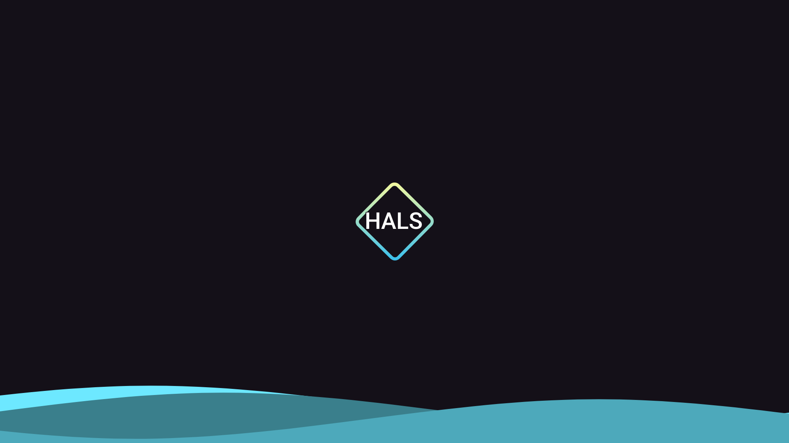
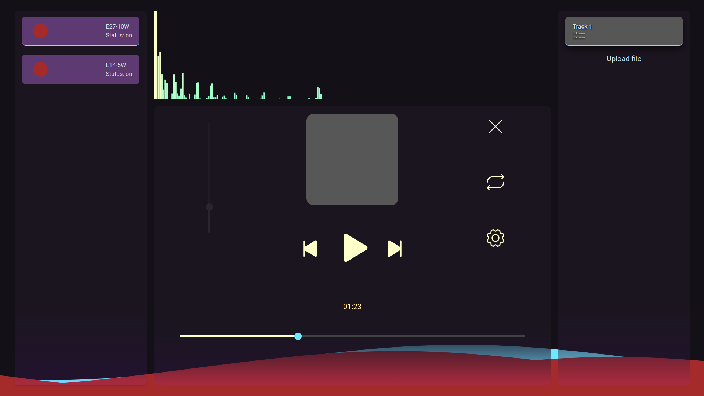

## Home Assistant Light Show
Home Assistant Light Show (HALS) is a fullstack light show app for Home Assistant built with NuxtJS and Meyda.
## Build and Install
Using your preferred package manager build the app.

    pnpm install
    pnpm build
Default settings will build server that can simply be launched with node.

    node .output/server/index.mjs  

After that just follow instructions on the screen.
App doesn't require additional setting for normal operation.
## Usage

**First of all app relies on Home Assistant to work.** It is designed to send requests to the HA server to change lamps color and brightness.

App uses Meyda to get audio features of uploaded audio files and automatically determines songs BPM thanks to code by [chrisguttandin](https://github.com/chrisguttandin/web-audio-beat-detector).

By default app decides which **color to set lamps to by dominating octave** at the moment of the beat or can be set to be random. While in Octave mode each octave can be assigned ether a specific color or a HSL range.

Other audio feature that determines lamp parameters is **Spectral Rolloff** which is a frequency bellow which 99% of 
the spectrogram frequencies are contained. From my testing sudden changes in rolloff is a good way to detect sharp changes in songs, 
so **it is responsible for brightness** and  **turning lamps to full bright or turning them off** depending on the 
difference between current beat rolloff and the previous one.

**All settings described above can be modified in settings menu accessible from audio player.**

## Future features

You can always request additional features here if you want. But now plans are:

- Saving settings and songs paths in local storage or on the server
- Adaptive design
- Mobile version
- More settings and modes of operation
- Better analyzing algorithms
-  Light show based on live audio feed and not on uploaded songs
- Full localization to Russian
- Many bug fixes

